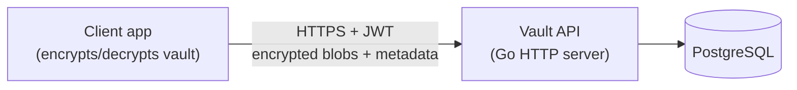
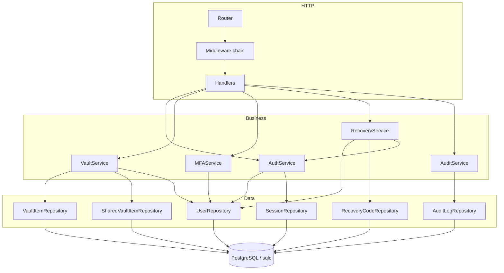
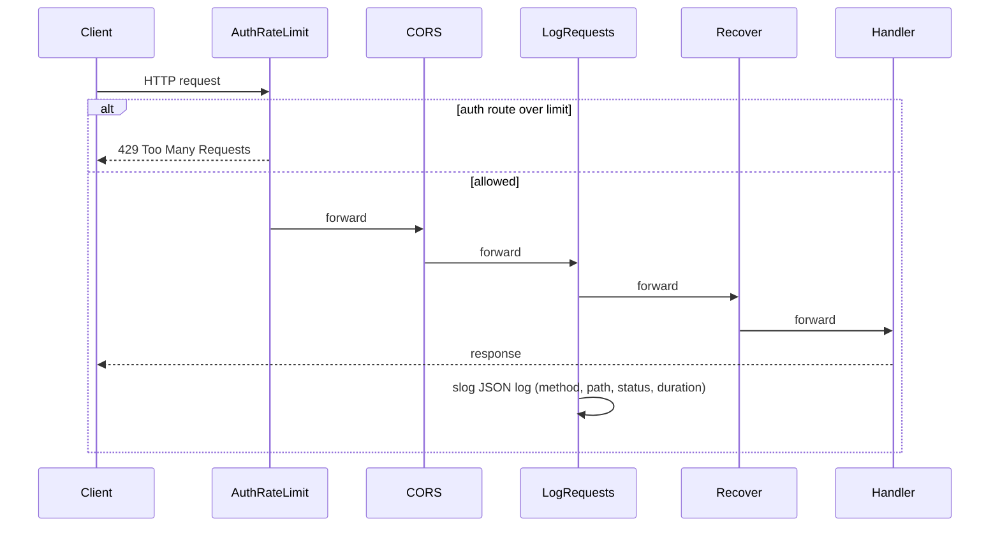
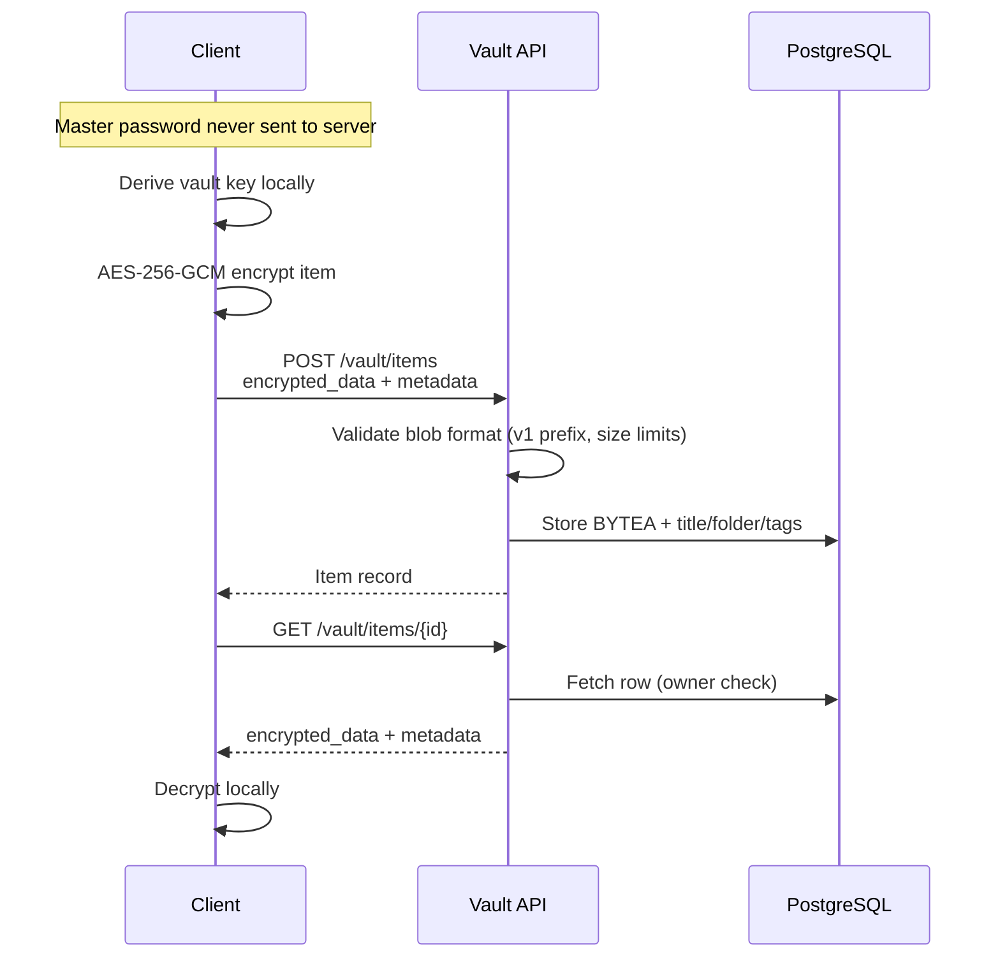
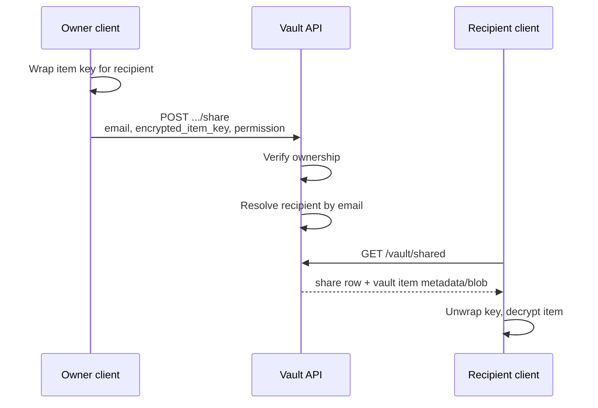
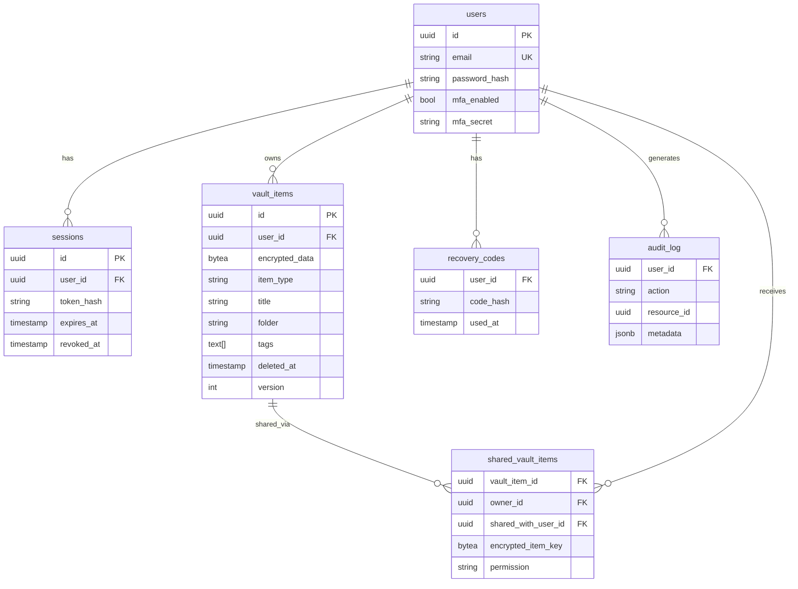

# Vault API — Architecture

This document describes the **as-built** architecture of the Vault API backend: a zero-knowledge password vault server written in Go. The API authenticates users and stores encrypted vault data; clients are responsible for encryption, key derivation, and decryption.

For HTTP details see [`openapi.yaml`](openapi.yaml). For security analysis see [`threat_model.md`](threat_model.md).

---

## Goals

1. **Zero-knowledge vault data** — The server never receives the user's master password or plaintext vault secrets.
2. **Production-shaped backend** — Layered design, migrations, audit logging, tests, and CI.
3. **Clear security boundaries** — Separate account authentication (server-side) from vault encryption (client-side).

---

## System context



| Component | Role |
|-----------|------|
| **Client** | Derives vault keys from master password; encrypts items before upload; decrypts after download. Not part of this repository. |
| **Vault API** | Account auth, sessions, MFA, vault CRUD, sharing records, audit logs. |
| **PostgreSQL** | Persistent storage for users, sessions, encrypted blobs, shares, recovery code hashes, audit events. |

**Note:** Docker Compose also defines Redis, but the application does not use it yet. Sessions and rate limiting are handled in-process / in Postgres today.

---

## Layered application architecture

The server follows a classic **handler → service → repository** layout:



### Package map

| Path | Responsibility |
|------|----------------|
| `cmd/server` | Process entrypoint, config load, DB connect, graceful shutdown |
| `internal/api/router.go` | Route table and dependency wiring |
| `internal/api/handlers` | HTTP parsing, status codes, JSON responses |
| `internal/api/middleware` | Auth, CORS, logging, panic recovery, rate limiting |
| `internal/service` | Business rules, authorization checks, audit emission |
| `internal/repository` | Postgres access via pgx + sqlc-generated queries |
| `internal/domain` | Core entity types |
| `internal/crypto` | Password hashing, JWT, TOTP helpers, blob validation |
| `migrations/` | Goose-format SQL schema (applied manually or in tests) |
| `docs/openapi.yaml` | Machine-readable API contract |

---

## Request lifecycle

Every request passes through a fixed middleware chain (outermost first):



Protected routes add `RequireAuth` **per route** (not globally):

1. Parse `Authorization: Bearer <JWT>`
2. Validate JWT signature and expiry (HS256, 15-minute TTL)
3. Load session from DB by JWT `jti` (session ID); reject if revoked or expired
4. Confirm session `user_id` matches JWT subject
5. Inject `userID` and `sessionID` into request context

---

## Authentication and sessions

### Account password (server-side)

- Signup/login use **Argon2id** (`alexedwards/argon2id`, default parameters) for the **account password** hash stored in `users.password_hash`.
- This password authenticates the user to the API. It is **not** the same thing as the client-side master password used to encrypt vault items (though a client may choose to reuse it).

### Token model

| Token | Format | Lifetime | Storage |
|-------|--------|----------|---------|
| **Access token** | JWT (HS256), subject = user ID, `jti` = session ID | 15 minutes | Client only |
| **Refresh token** | 32 random bytes, base64url | 7 days (session `expires_at`) | Client only; **SHA-256 hash** stored in `sessions.token_hash` |

On login (or recovery verify), the server creates a session row and returns both tokens. Refresh exchanges a valid refresh token for a new access token without rotating the refresh token.

Logout and session revoke set `sessions.revoked_at`; subsequent access token use fails at the DB session lookup.

### MFA (TOTP)

- Enrollment: `POST /mfa/enable` generates a secret; `POST /mfa/verify` confirms a TOTP code and sets `users.mfa_enabled = true`.
- Login with MFA enabled requires `totp_code` unless using a recovery code flow.
- TOTP secret is stored server-side in `users.mfa_secret` (required for server-side verification). This applies to **account** MFA, not vault decryption.

### Recovery codes

- Generated only when MFA is enabled; replaces prior unused codes.
- Ten codes per generation; plaintext shown once; **SHA-256 hashes** stored in `recovery_codes`.
- `POST /recovery/verify` validates email + account password + code, marks code used, issues tokens (bypasses TOTP).

---

## Zero-knowledge vault model

The backend implements the **storage and access-control** half of zero-knowledge design. Cryptographic protection of vault contents is enforced by the client.



### Server responsibilities

- Store `encrypted_data` opaque blob (max 1 MB)
- Validate blob **format** only: version byte `0x01`, non-empty, size bounds (`internal/crypto/validation.go`)
- Store **unencrypted metadata**: `title`, `folder`, `tags`, `item_type` — enables listing and filtering without decryption
- Enforce ownership and sharing permissions at the API layer

### Client responsibilities (assumed, not implemented here)

- Master password → key derivation (e.g. Argon2/PBKDF2)
- Encrypt/decrypt vault item payloads
- Wrap item keys for sharing (`encrypted_item_key` in share requests)

### Encrypted blob format (server validation)

```
[0x01 version byte][client ciphertext...]
```

The server does not parse ciphertext structure beyond the version prefix.

---

## Vault item lifecycle

- **Create / read / update** — Owner-only; updates use optimistic locking via `version`.
- **Soft delete** — Sets `deleted_at`; item hidden from normal list/get.
- **Restore** — Clears `deleted_at` for owner with matching version.
- **List** — Paginated (`limit` default 50, max 100); filters on `folder`, `item_type`, `tag`, `title`.

A automated 30-day purge of soft-deleted items is **not** implemented yet.

---

## Vault sharing

Sharing uses a separate `shared_vault_items` table. The owner shares by email:



- Permissions: `read` or `write` (stored; write enforcement on vault update for shared users is a future client/API enhancement — today vault mutations check owner only).
- Revoke: owner `DELETE .../share/{user_id}`

---

## Data model



Migrations live in `migrations/` and are applied with goose (or manually in integration tests).

---

## Audit logging

Sensitive operations emit audit events **asynchronously best-effort** — failures are logged with `slog` but do not fail the user request.

| Action | Trigger |
|--------|---------|
| `auth.signup`, `auth.login`, `auth.logout`, `auth.session.revoke` | Auth flows |
| `vault.item.create/update/delete/restore` | Vault CRUD |
| `vault.item.share`, `vault.item.share.revoke` | Sharing |
| `mfa.enable/verify/disable` | MFA |
| `recovery.generate`, `recovery.verify` | Recovery |

Each entry captures `user_id`, `action`, optional `resource_type` / `resource_id`, client IP, user agent, and JSON `metadata`. Users can list their own logs via `GET /api/v1/audit/logs`.

---

## Configuration

Environment variables (see `internal/config/config.go`):

| Variable | Default | Purpose |
|----------|---------|---------|
| `PORT` | `8081` | HTTP listen port |
| `DATABASE_URL` | local Postgres DSN | Database connection |
| `JWT_SECRET` | `change-me` | HS256 signing key |
| `REDIS_URL` | `redis://localhost:6379` | Reserved; unused by app |
| `CORS_ALLOWED_ORIGINS` | empty | Comma-separated allowed origins |

---

## Deployment

### Docker Compose (`docker/docker-compose.yml`)

- **app** — Built from `docker/Dockerfile`; exposes port 8081 on host
- **postgres** — PostgreSQL 17 with persistent volume
- **redis** — Present for future use (sessions/cache/rate limits)

Run migrations against Postgres before or during deploy (not automated on app startup today).

### Observability (current)

| Feature | Status |
|---------|--------|
| Structured JSON request logs (`slog`) | Implemented |
| `GET /health` | Implemented (liveness only, no DB check) |
| `GET /ready` | Implemented (PostgreSQL ping) |
| Prometheus `GET /metrics` | Implemented |
| Distributed tracing | Not implemented |

---

## CI/CD

GitHub Actions (`.github/workflows/ci.yml`) on push and PR:

1. `go mod verify`
2. OpenAPI spec validation (`swagger-cli`)
3. `golangci-lint`
4. Unit tests (`-race`)
5. Integration tests (`-tags=integration`, testcontainers Postgres)
6. `go build ./cmd/server`

---

## Design decisions

| Decision | Rationale |
|----------|-----------|
| **sqlc + pgx** | Type-safe SQL, no ORM magic, good performance |
| **JWT + DB-backed sessions** | Short-lived JWTs with server-side revocation via session row |
| **Metadata stored in plaintext** | Enables search/filter UX; trade-off documented in threat model |
| **In-memory IP rate limit** | Simple MVP; 10 req/min per IP on signup/login/refresh |
| **Audit fail-open** | Availability over strict audit consistency; ops alerted via logs |
| **Blob version byte** | Forward-compatible client format without server parsing ciphertext |

---

## Related documentation

- [OpenAPI specification](openapi.yaml)
- [Threat model](threat_model.md)
- [README](../README.md)
