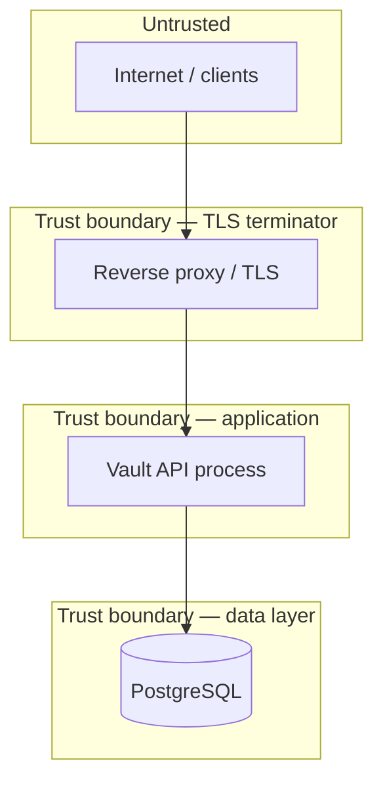

# Vault API — Threat Model

This document analyzes security threats for the Vault API backend using a structured **assets → boundaries → threats → mitigations** approach. It reflects the **current implementation**, including known gaps.

Companion docs: [Architecture](architecture.md) | [OpenAPI](openapi.yaml)

---

## 1. Scope

### In scope

- HTTP API (`/api/v1/*`, `/health`)
- Authentication, sessions, MFA, recovery codes
- Vault item storage, sharing metadata, audit logs
- PostgreSQL data at rest (as accessed by the application)
- Deployment via Docker Compose (development-oriented defaults)

### Out of scope

- Client application code (encryption implementation, secure storage, UX)
- Physical security of user devices
- TLS termination / WAF / CDN (assumed upstream)
- PostgreSQL host hardening beyond connection string
- Redis (present in Compose but unused)
- Supply chain of third-party dependencies (covered at high level only)

---

## 2. Assets

| Asset | Sensitivity | Location |
|-------|-------------|----------|
| Vault ciphertext (`encrypted_data`) | **High** — secrets if client crypto fails | PostgreSQL `vault_items` |
| Wrapped share keys (`encrypted_item_key`) | **High** — item keys if wrapping weak | PostgreSQL `shared_vault_items` |
| Account password hashes | **High** | PostgreSQL `users.password_hash` |
| MFA TOTP secrets | **High** — enables account MFA bypass | PostgreSQL `users.mfa_secret` |
| Refresh token hashes | **High** — session hijack if leaked | PostgreSQL `sessions.token_hash` |
| JWT signing secret (`JWT_SECRET`) | **Critical** — forge tokens if leaked | App environment |
| Recovery code hashes | **High** | PostgreSQL `recovery_codes` |
| Vault metadata (title, folder, tags, item_type) | **Medium** — information disclosure | PostgreSQL `vault_items` |
| Audit logs | **Medium** — activity patterns, IPs | PostgreSQL `audit_log` |
| Session metadata (IP, user agent, device name) | **Low–Medium** | PostgreSQL `sessions` |

**Zero-knowledge goal:** Vault plaintext and master password never appear on the server. Account password and MFA secrets *do* exist on the server for authentication.

---

## 3. Trust boundaries

| Boundary | Trust assumption |
|----------|------------------|
| Client ↔ API | Client is honest but may be buggy; attacker may control network without TLS |
| API ↔ PostgreSQL | DB credentials limited to app; network private |
| Operators | `JWT_SECRET` and DB backups protected |

---

## 4. Assumptions

1. **TLS in production** — All client traffic encrypted in transit (not enforced by the Go app itself).
2. **Strong `JWT_SECRET`** — Random, rotated, not committed to source control.
3. **Client crypto is correct** — Proper KDF, AEAD (e.g. AES-256-GCM), random nonces, no key reuse.
4. **Users protect master password** — Separate from account password if required by client design.
5. **Postgres is hardened** — Network isolation, least-privilege DB user, encrypted backups.
6. **Clock sync** — TOTP validation depends on reasonable server time (RFC 6238).

---

## 5. Threat analysis

### T1 — Server / database compromise

**Scenario:** Attacker obtains read access to PostgreSQL or disk snapshots.

| Data exposed | Impact |
|--------------|--------|
| `encrypted_data`, `encrypted_item_key` | Ciphertext only; safe if client crypto holds |
| `title`, `folder`, `tags` | **Metadata leak** — URLs, account names, organizational structure |
| `password_hash` | Offline cracking attempts on account password |
| `mfa_secret` | Generate valid TOTP codes → account takeover |
| `recovery_codes` (hashes) | Offline brute-force of 8-char codes (mitigated by hash + rate limits on verify) |

**Mitigations (implemented):**

- Zero-knowledge vault blobs (no server decryption keys)
- Argon2id for account passwords
- SHA-256 for refresh tokens and recovery codes (never store plaintext)
- MFA and recovery for account takeover resistance

**Residual risk:**

- Metadata remains readable to DB attacker
- MFA secrets in DB bypass TOTP if DB read + online access combined
- No application-level encryption at rest for DB columns

---

### T2 — Network eavesdropping (MITM)

**Scenario:** Attacker on network path reads or modifies API traffic.

**Mitigations:**

- TLS assumed at reverse proxy
- Vault payloads already encrypted client-side (defense in depth for vault contents)
- JWT in `Authorization` header (must not log tokens)

**Residual risk:**

- Without TLS, account password and tokens exposed on login/signup
- Metadata and ciphertext visible on wire without TLS

---

### T3 — Brute force and credential stuffing

**Scenario:** Attacker automates login, signup abuse, or refresh attempts.

**Mitigations (implemented):**

- In-memory rate limit: **10 requests/minute per IP** on `POST /auth/signup`, `/auth/login`, `/auth/refresh`
- Argon2id slows offline hash cracking
- Generic `invalid credentials` on login failure (no email enumeration on login)
- MFA required when enabled
- Recovery codes are one-time

**Gaps:**

- Rate limiting is **per-process** (not shared across replicas); Redis not wired
- No CAPTCHA or account lockout after N failures
- Signup conflict returns `409 email already exists` (email enumeration on signup)
- Recovery verify not rate-limited separately from auth bucket

---

### T4 — Session hijacking / token theft

**Scenario:** Attacker steals access JWT or refresh token from client storage, logs, or XSS.

**Mitigations (implemented):**

- Short access token TTL (**15 minutes**)
- Refresh token stored as hash only; raw token never persisted server-side
- Session revocation (logout, revoke session) sets `revoked_at`
- Auth middleware re-validates session row (revoked/expired sessions rejected)
- Session list shows device/IP for user review

**Gaps:**

- No refresh token rotation on use
- No binding of token to device fingerprint beyond stored metadata
- JWT is bearer token — anyone with token can authenticate until expiry/revocation
- No `HttpOnly` cookie option (API returns tokens in JSON body — client must store securely)

---

### T5 — Account takeover

**Scenario:** Attacker gains access to user account via stolen password, MFA bypass, or recovery code.

**Mitigations (implemented):**

- MFA (TOTP) after enrollment
- Recovery codes require MFA enabled; single-use; hashed storage
- Recovery login still requires account password
- Audit log of auth events, MFA changes, recovery use
- User can revoke other sessions

**Attack paths:**

| Path | Mitigation |
|------|------------|
| Stolen account password | MFA if enabled |
| Stolen TOTP device | Recovery codes (if saved); password still needed for recovery |
| Stolen recovery code | Password still required; code single-use |
| DB leak of `mfa_secret` | Attacker generates TOTP — **critical**; protect DB |

---

### T6 — Unauthorized vault access (horizontal / vertical)

**Scenario:** User A accesses User B's vault items or shares without permission.

**Mitigations (implemented):**

- All vault routes require authentication
- `GetItem`, update, delete check `item.user_id == authenticated user`
- Share create/revoke restricted to item owner
- Shared list filtered by `shared_with_user_id`

**Gaps:**

- Shared users with `write` permission cannot yet update via API (owner-only mutations today)
- No org/admin roles (single-tenant user model)

---

### T7 — Malicious or malformed vault payloads

**Scenario:** Attacker uploads oversized blobs, unsupported formats, or attempts DoS.

**Mitigations (implemented):**

- Max blob size 1 MB; min size and version byte check
- Max share key size 4 KB
- Optimistic locking prevents silent overwrites (`version` mismatch → 404)

**Gaps:**

- No per-user storage quotas
- Metadata fields not length-validated aggressively at service layer

---

### T8 — Sharing misuse

**Scenario:** Owner shares item with wrong email; recipient gains wrapped key.

**Mitigations:**

- Client must encrypt `encrypted_item_key` for intended recipient only
- Server resolves email → user ID; cannot share with self
- Duplicate share rejected (409)
- Owner can revoke share

**Residual risk:**

- Server sees recipient identity and permission level
- Mis-typed email shares with wrong account (client/server cannot undo without revoke)

---

### T9 — Audit log tampering or loss

**Scenario:** Attacker covers tracks; operator cannot investigate incident.

**Mitigations (implemented):**

- Append-only insert from application
- User-scoped read API

**Gaps:**

- No WORM storage or SIEM integration
- Audit write failures are **fail-open** (request succeeds, error logged)
- No admin/global audit view

---

### T10 — Denial of service

**Scenario:** Attacker floods API or uploads large payloads.

**Mitigations:**

- Auth endpoint rate limiting
- Blob size cap
- Pagination limits (max 100)

**Gaps:**

- No global rate limit on vault/audit routes
- In-memory limiter resets per instance; memory grows with distinct IPs
- No request body size limit configured on `http.Server`

---

### T11 — Insider / operator threats

**Scenario:** Developer with production access reads DB or JWT secret.

**Mitigations:**

- Vault ciphertext not decryptable without user master password (client-side)
- Secrets via environment variables (not in repo)

**Gaps:**

- Operators can read metadata, MFA secrets, and ciphertext
- No HSM or envelope encryption for DB columns
- Dev Compose uses weak default `JWT_SECRET=dev-secret`

---

## 6. STRIDE summary

| Category | Primary concerns | Key controls |
|----------|------------------|--------------|
| **Spoofing** | Fake tokens, session hijack | JWT + DB session, Argon2id, MFA |
| **Tampering** | Vault item overwrite | Optimistic locking (`version`) |
| **Repudiation** | Deny sensitive actions | Audit log (best-effort) |
| **Information disclosure** | Metadata, DB leak, signup 409 | Client encryption; protect DB |
| **Denial of service** | Auth flood, large blobs | Rate limit, size limits |
| **Elevation of privilege** | Cross-user vault access | Owner checks on all mutations |

---

## 7. Explicitly out of scope

| Threat | Reason |
|--------|--------|
| Client-side malware | Assumes trusted client implementation |
| Physical device theft | User/device responsibility |
| Social engineering | Recovery codes / password disclosure by user |
| Quantum attacks on AES | Long-term crypto policy, not MVP |
| Compromised client build | Supply chain of client app |
| Side-channel attacks | Standard web app assumption |

---

## 8. Security trade-offs

| Choice | Benefit | Cost |
|--------|---------|------|
| Plaintext metadata | Search, filter, list UX | Titles/tags leak on DB compromise |
| Server-side TOTP verification | Simple API login flow | MFA secret stored in DB |
| JWT bearer tokens | Stateless validation + session revoke | Token theft = access until revoked |
| Fail-open audit | User operations never blocked by audit DB issues | Incomplete audit trail possible |
| In-memory rate limit | No Redis dependency | Weak under horizontal scale |
| Soft delete | Recovery from accidental delete | Deleted items retained until purge job exists |
| HS256 JWT | Simple deployment | Shared secret must be guarded |

---

## 9. Recommended hardening (not yet implemented)

Priority follow-ups for production:

1. **TLS only** — Terminate TLS at proxy; HSTS; no plain HTTP in prod
2. **`/ready` probe** — DB connectivity check for orchestrators
3. **Distributed rate limiting** — Redis-backed limiter; extend to recovery verify
4. **Refresh token rotation** — Detect reuse of stolen refresh tokens
5. **Request body size limits** — `http.MaxBytesReader` on handlers
6. **Automated purge** — Hard-delete vault items after 30-day soft delete
7. **Secrets management** — Vault/KMS for `JWT_SECRET`; never default dev secret
8. **Enforce share write permission** — Allow shared `write` users to update items
9. **Password change + key re-wrap API** — Client-driven vault key rotation
10. **Prometheus + alerting** — Rate limit hits, auth failures, audit write errors (metrics endpoint exists; alerting not wired)

---

## 10. Review checklist

Use this for interviews or security reviews:

- [ ] Can the server decrypt vault items? **No** (client holds keys)
- [ ] What leaks if Postgres is read-only compromised? **Ciphertext, metadata, MFA secrets, hashes**
- [ ] How are sessions revoked? **`revoked_at` on session row; checked on each request**
- [ ] Is MFA enough to stop password-only takeover? **Yes, when enabled**
- [ ] What fails open vs closed? **Audit fails open; auth fails closed**
- [ ] Where is zero-knowledge enforced? **Client encryption + server blob validation only**

---

## References

- [OWASP Password Storage Cheat Sheet](https://cheatsheetseries.owasp.org/cheatsheets/Password_Storage_Cheat_Sheet.html)
- [RFC 6238 — TOTP](https://datatracker.ietf.org/doc/html/rfc6238)
- [Bitwarden Security White Paper](https://bitwarden.com/help/bitwarden-security-white-paper/) — zero-knowledge password manager design patterns
